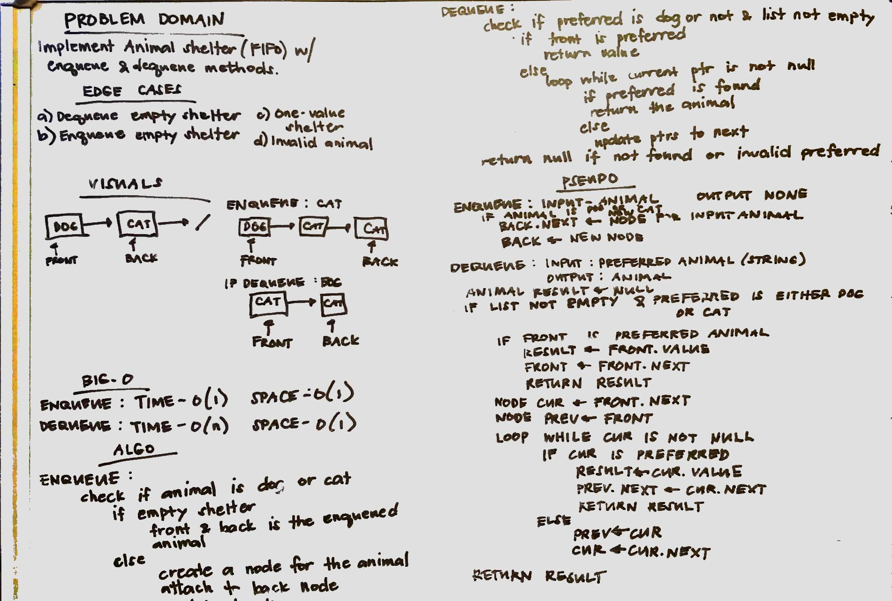

# Animal Shelter
Implemented a FIFO animal shelter.

## Challenge
Create an AnimalShelter using first-in-first-out for dog or cat animal. Implement enqueue and dequeue methods.
## Approach & Efficiency
Created a Node and Animal class. Used the concept of queues for FIFO. 
* Methods:

1. enqueue - Time and Space complexities: 0(1). Add using back pointer.
2. dequeue - Time complexity: 0(n) and Space Complexity: 0(1). Iterate through the list using current and previous pointers.

## API
### Initialization
`AnimalShelter sample = new AnimalShelter()`
### Methods

1.enqueue
* Method to insert a dog or cat to the queue. Parameter is the Animal object.

* Example: `sample.enqueue(new Animal("dog"))`

2.dequeue
* Method to remove and return the preferred animal. Parameter is a string which is either dog or cat.

* Example: `sample.dequeue("dog")`

## Source Code
* [AnimalShelter](./src/main/java/fifoAnimalShelter/AnimalShelter.java)
* [AnimalShelterTest](./src/test/java/fifoAnimalShelter/AnimalShelterTest.java)
* WhiteBoard
