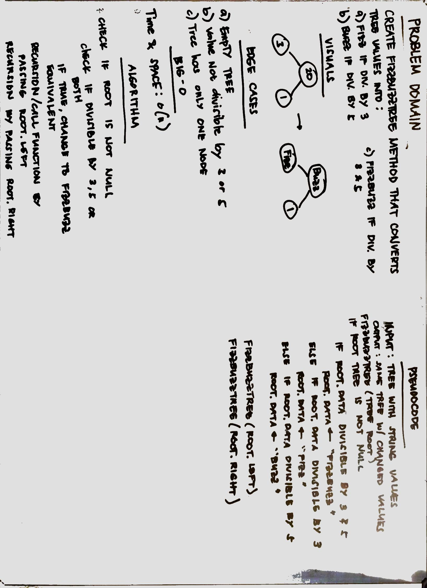

# FizzBuzzTree
Conduct “FizzBuzz” on a tree while traversing through it. Change the values of each of the nodes dependent on the current node’s value.
## Challenge
Create a fizzBuzzTree method that converts tree values into:
 1. "Fizz" if divisible by 3
 2. "Buzz" if divisible by 5
 3. "FizzBuzz" if divisible by 3 and 5
 4. No change if none of the above applies
 
## Approach and Efficiency
Used the recursion with pre-order traversal to check and convert each node. Each node string data was converted to Integer and then evaluated using mod operation to check divisibility.Time and space complexities: 0(n) with the recursion.
## API
1. fizzBuzzTree - accepts Tree with String datatype.
Usage example: 
`Tree<String> numbers = new Tree<>(new Node("20"));`
`FizzBuzzTree.fizzBuzzTree(numbers);`
       
## Source Code
* [FizzBuzzTree](./src/main/java/FizzBuzzTree/FizzBuzzTree.java)
* [FizzBuzzTreeTest](./src/test/java/FizzBuzzTree/FizzBuzzTreeTest.java)
* 
