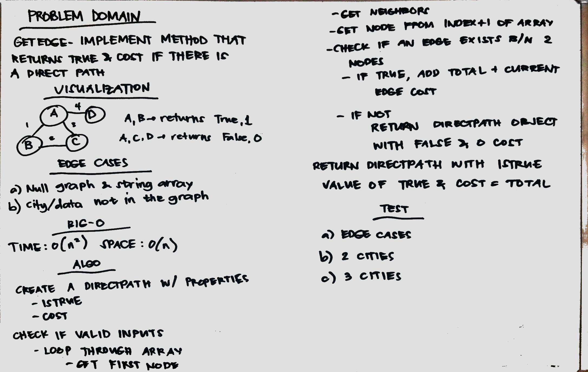

# GET EDGE
Determine if there is a direct path in the graph

## Challenge
Implement a method with arguments graph and string array, such that, when there is a direct path, the boolean is returned with the corresponding cost.

## Approach & Efficiency
1. Created a DirectPath class that has an isTrue and cost property.
2. GetEdge method has time complexity of O(n^2) since you are looping through the array and then checking the edges for the corresponding cost of the edge. Space is O(n) for the set that is used for the retrieved neighbor set.

## Source Codes
* [GetEdge class](./src/main/java/getedge/GetEdge.java)
* [GetEdge Test](./src/test/java/getedge/GetEdgeTest.java)
