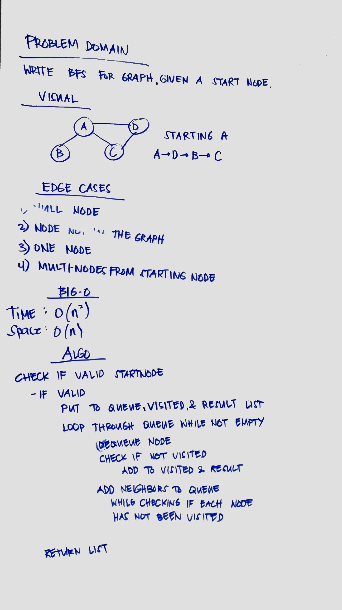

# Graphs
Graph is a flow structure that represents the relationship between various objects. It can be visualized by using the following two basic components:

1. Nodes: These are the most important components in any graph. Nodes are entities whose relationships are expressed using edges. If a graph comprises 2 nodes  and  and an undirected edge between them, then it expresses a bi-directional relationship between the nodes and edge.

2. Edges: Edges are the components that are used to represent the relationships between various nodes in a graph. An edge between two nodes expresses a one-way or two-way relationship between the nodes.

## Challenge
Implement graph data structures with the following methods:
1. AddNode()
2. AddEdge()
3. GetNodes()
4. GetNeighbors()
5. Size()
6. BreadthFirst()

## Approach & Efficiency
To create the Graph, a Node and an Edge class are created. The graph then has a property of nodes that uses a HashMap data structure.
1. AddNode()
- Time and space complexities: O(1)

2.AddEdge()
- Time and space complexities: O(1)
 
3.GetNodes()
- Time and space complexities: O(1)

4.GetNeighbors()
- Time 0(n) and space complexities: O(n)

5.Size()
- Time 0(n) and space complexities: O(1)

6. BreadthFirst()
- Time O(n^2) since looping through queue and set of neighbors
- Space O(n) from using list

## API
1. AddNode()
- Adds a new node to the graph
- Takes in the value of that node
- Returns the added node

2.AddEdge()
- Adds a new edge between two nodes in the graph
- Include the ability to have a “weight”
- Takes in the two nodes to be connected by the edge
- Both nodes should already be in the Graph

3.GetNodes()
- Returns all of the nodes in the graph as a collection (set, list, or similar)

4.GetNeighbors()
- Returns a collection of nodes connected to the given node
- Takes in a given node
- Include the weight of the connection in the returned collection

5.Size()
- Returns the total number of nodes in the graph

6. BreadthFirst()
- returns list based from breadth-first traversal

## Source Codes
* [Graph classes](./src/main/java/graph/Graph.java)
* [Graph Test](./src/test/java/graph/GraphTest.java)
* BreadthFirst
