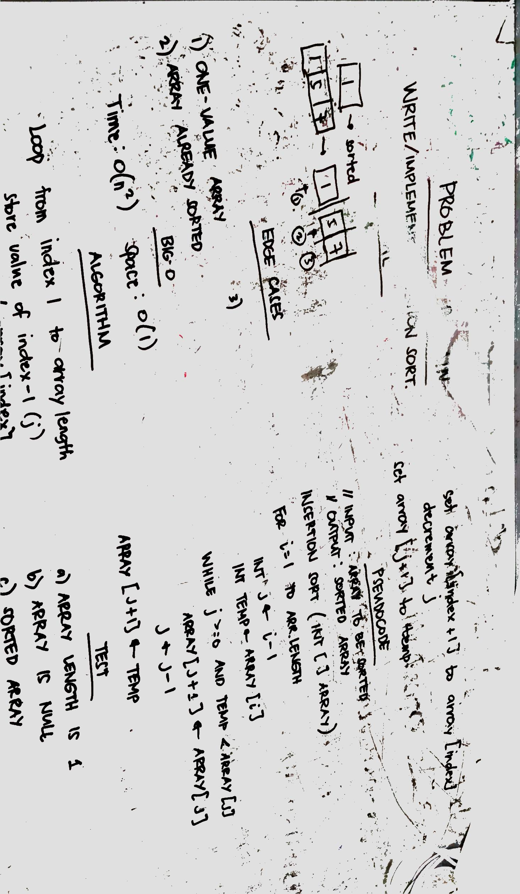

# Lecture Notes: Insertion Sort
Insertion sort is a simple sorting algorithm that builds the final sorted array (or list) one item at a time. It is much less efficient on large lists than more advanced algorithms such as quicksort, heapsort, or merge sort. However it is more efficient with small datasets as compared to selection sort or bubble sort. The algorithm is considered adaptive, stable, in-place, and online, where it sort the list as it receives it.

## Learning Objective
* Understand implementation of insertion sort

## Lecture Flow
Insertion sort is based on the idea that one element from the input elements is consumed in each iteration to find its correct position i.e, the position to which it belongs in a sorted array.

It iterates the input elements by growing the sorted array at each iteration. It compares the current element with the largest value in the sorted array. If the current element is greater, then it leaves the element in its place and moves on to the next element else it finds its correct position in the sorted array and moves it to that position. This is done by shifting all the elements, which are larger than the current element, in the sorted array to one position ahead.

This sorting algorithm is considered inefficient as you have to loop through the array twice based from time complexity of O(n^2) and space complexity of O(1).

## Diagram


## Algorithm
Loop through the input array starting from index 1 to array length.
    get the current index and store to a temp variable
    initialize j with previous index
    loop while j is greater than or equal to 0 and previous index value is greater than the current value (temp)
        shift values greater than the current value to the right 
    set index j+ 1 with the temp value
    
## Pseudocode

```python
InsertionSort(int[] arr)
     
       FOR i = 1 to arr.length
       
         int j = i - 1
         int temp = arr[i]
         
         WHILE j >= 0 AND temp < arr[j]
           arr[j + 1] = arr[j]
           j = j - 1
           
         arr[j + 1] = temp
```

## Readings and References 
### Watch 
* https://www.youtube.com/watch?v=i-SKeOcBwko

### Read
* https://www.hackerearth.com/practice/algorithms/sorting/insertion-sort/tutorial/
* https://en.wikipedia.org/wiki/Insertion_sort

### Bookmark
* https://www.geeksforgeeks.org/insertion-sort/

### Sources
* [Insertion Sort](./src/main/java/sortingAlgo/InsertionSort.java))
* [Insertion Sort Test](./src/test/java/sortingAlgo/InsertionSortTest.java))

