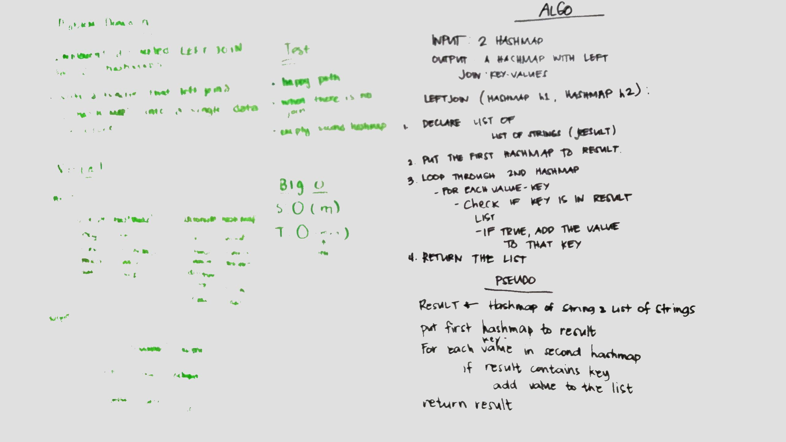

# Challenge Summary
Left join synonym and antonyms hashmap.

## Challenge Description
Implement a method, given two hashmaps, returns the new left joined map.
## Approach & Efficiency
The solution has a time and space complexities of O(n) since we are using iterating through the hashmap and add it to the resulting hashmap.The method returns null if first hashmap is null.

## Solution
* [LeftJoin](./src/main/java/leftjoin/LeftJoin.java)
* [LeftJoin Test](./src/test/java/leftjoin/LeftJoinTest.java)
* 
