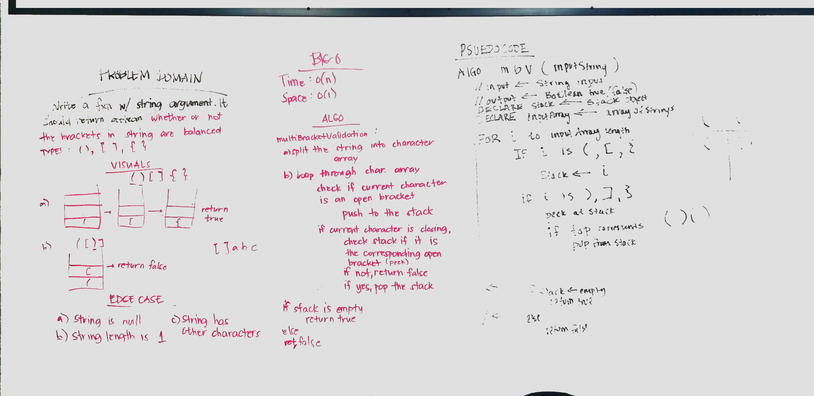

# Multibracket Validation
Validate brackets ({}, (), []) if balanced or not. Paired with Liz Mahoney.

## Challenge
Given a string, create a multibracketvalidation method that will return boolean if the brackets are balanced or not.

## Approach and Efficiency
The approach is to put the open brackets to the stack while traversing the character array. If the character is  the closing bracket, check the stack if it is the corresponding pair. Iteration through the character array takes 0(n) time and 0(n) space complexity for the use of array and stack in the multibracketvalidation method. 

## API
To use: `MultiBracketValidation.multiBracketValidation(String input)`

## Source Code
* [MultiBracketValidation class](./src/main/java/multibracketvalidation/MultiBracketValidation.java)
* [MultiBracketValidationTest class](./src/main/test/multibracketvalidation/MultiBracketValidationTest.java)
* 