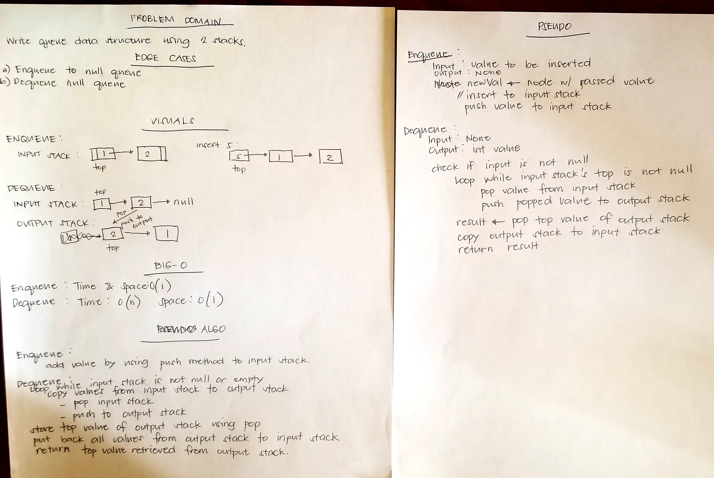

# PseudoQueue
Implemented queue data structure using two stacks.

## Challenge
Create a PseudoQueue using two stacks. Implement enqueue and dequeue methods.
## Approach & Efficiency
Created input and output stacks with methods and constructors. 
* Methods:

1. enqueue - Time and Space complexities: 0(1). Add to the input stack using push method.
2. dequeue - Time complexity: 0(n) and Space Complexity: 0(1). Iterate through input stack and copy values to output stack.

## API
### Initialization
`PseudoQueue sample = new PseudoQueue()`
### Methods

1.enqueue
* Method to insert value to the queue. Parameter is the integer value to be inserted.

* Example: `sample.enqueue(1)`

2.dequeue
* Method to remove and return the top value. No parameter.

* Example: `sample.dequeue()`

## Source Code
* [PseudoQueue](./src/main/java/queueWithStacks/PseudoQueue.java)
* [PseudoQueueTest](./src/test/java/queueWithStacks/PseudoQueueTest.java)
* WhiteBoard
