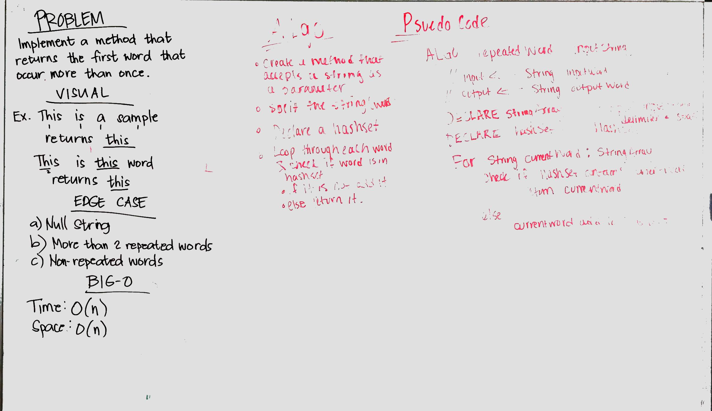

# Challenge Summary
Find the first repeated word in a book.

## Challenge Description
Implement a method, given a string, returns the first word that occurs more than once in the string.

## Approach & Efficiency
The solution has a time and space complexities of O(n) since we are using array to split and iterate through the array to check if the word exists in the HashSet.The method excludes non-alphabet characters.

## Solution
* [RepeatedWord](./src/main/java/RepeatedWord/RepeatedWord.java)
* [RepeatedWord Test](./src/test/java/RepeatedWord/RepeatedWordTest.java)
* 
