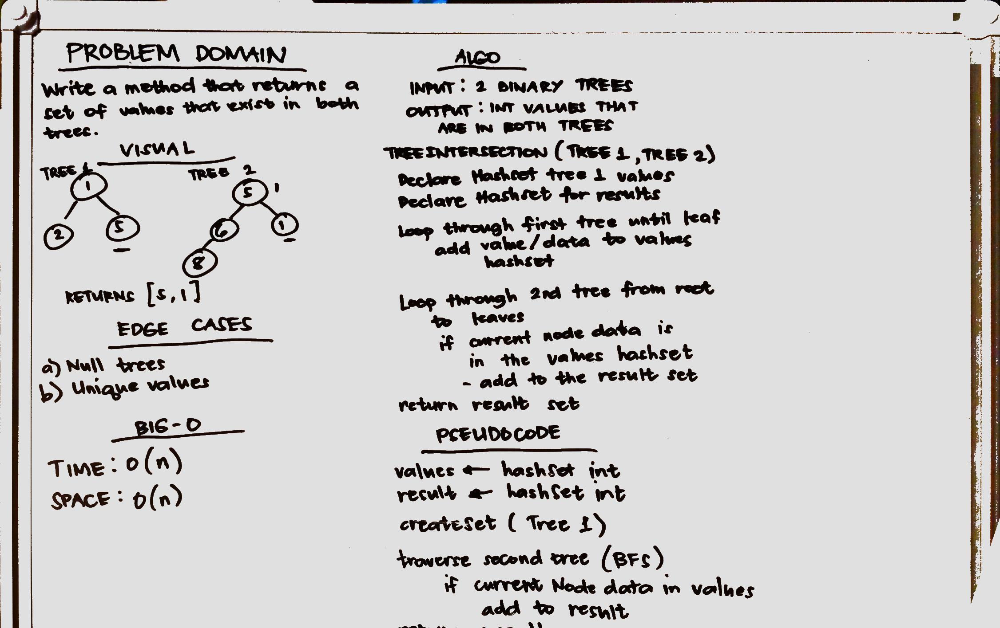

# Challenge Summary
Find common values in 2 binary trees.

## Challenge Description
Implement a method, given two trees as parameters, returns the values that occur in both trees.
## Approach & Efficiency
The solution has a time and space complexities of O(n) since we are using sets to store the values and we are traversing through the trees.
## Solution
* [TreeIntersection class](./src/main/java/treeintersection/TreeIntersection.java)
* [TreeIntersection Test](./src/test/java/treeintersection/TreeIntersectionTest.java)
* 
