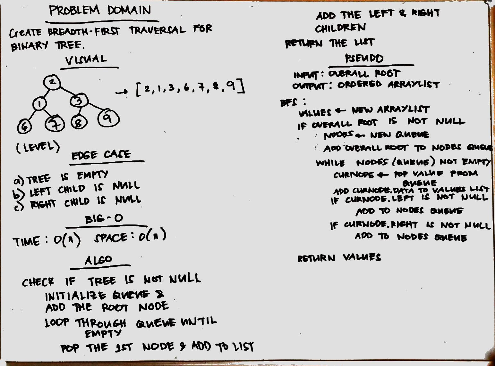
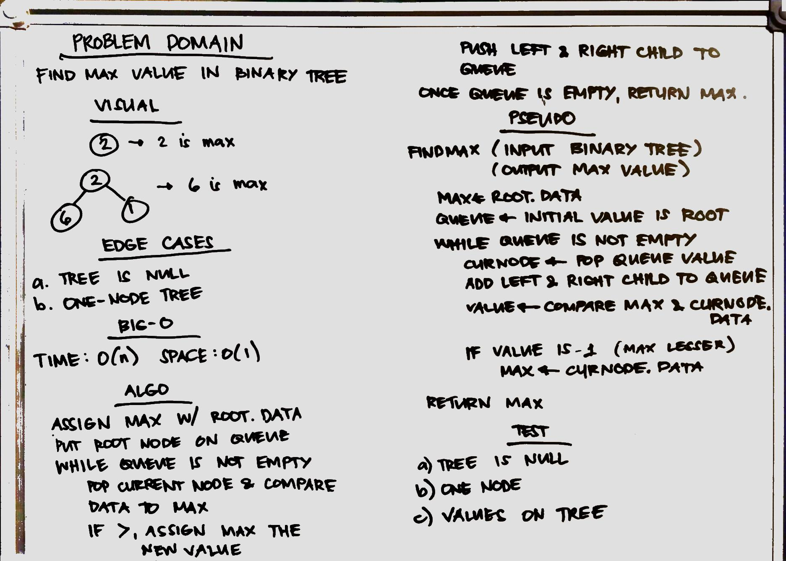

# Binary and Binary Search Trees
Code Challenge 18: Find maximum value in the binary tree.
Create trees with traversal.
## Challenge
Created a Binary Tree and Binary Search Tree with methods.
## Approach and Efficiency
### Binary Tree methods
* Traversals are 0(n) for time and space complexities with the use of recursion and arraylists respectively. 
### Binary Search Tree methods
* Adding and searching value takes 0(log n) for time since we keep searching the half part of tree. 0(n) space complexity for the recursion. 
* Breadth-first traversal takes O(n) time complexity from using while loop and O(n) space complexity for using arraylist.
* Used breadth-first traversal to traverse the tree. While traversing, the current node's value is checked against the current maximum. Time complexity is O(n) while space complexity is O(1).
## API
### Tree
* Initialization example: Tree<Integer> sample = new Tree<>()` 
#### Methods
1. preOrder - prerforms pre-order traversal where it prints the root first.. Displays the copy of the tree. 
2. inOrder - performs inorder traveral, where it goes to the left tree first.
3. postOrder - performs post order traversal. Normally used to delete tree.
4. breadthFirst - performs breadth-first traversal to display per level values.
5. findMaximumValue - returns the maximum value in the tree. 

### Binary Search Tree
* Initialization example: Tree<Integer> sample = new BinarySearchTree<>()` 
#### Methods
1. add - add value to the tree. Parameter can be any data type, i.e Integer, Character, etc.
2. contains - search for a value. Parameter can be any data type, i.e Integer, Character, etc.

## Source Code
* [BinarySearchTree class](./src/main/java/tree/BinarySearchTree.java)
* [BinarySearchTreeTest class](./src/test/java/tree/BinarySearchTreeTest.java)
* [Tree class](./src/main/java/tree/Tree.java)
* [TreeTest class](./src/test/java/tree/TreeTest.java)
* [Node](./src/main/java/tree/Node.java)

